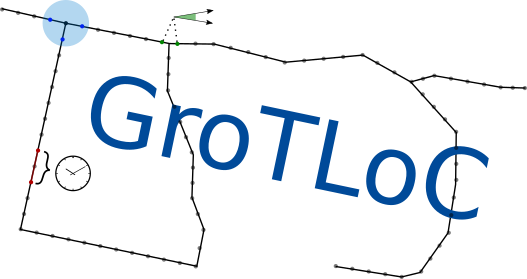

# GroTLoc


**Ground Truth for Loop Closure** (**GroTLoC**) is a tool that allows users to easily annotate Datasets with Ground Truth for Loop Detection (LGT) and Loop Closure based on previously obtained Positional Ground Truth (PGT).

---
## Acronyms and Abbreviations

**SLAM**: Simultaneous Localization and Mapping.

**LC**: Loop Closure.

**GT**: Ground Truth.

**LGT**: Loop Closure Ground Truth; a ground truth of poses and expected loop closures for a robot or system.

**PGT**: Positional Ground Truth; a ground truth in terms of poses of the robot or system.

**GroTLoC**: **Gro**und **T**ruth for **Lo**op **C**losure; the name of the tool in this repository.

---
## Problem Statement
In mobile robotics, the problem of Loop Closure encompasses detecting when a mobile robot finds itself transiting an area previously visited and using such information to adjutst the trajectory and estimated map of the robot.
It's a fundamental step on solving the SLAM problem by reducing the robot's accumulated drift.

In the literature you can find many LC systems based on different sources of information (cameras, laser sensors, proprioceptive sensors), and these systems need to be tested against known paths with known loop closures, what we call Loop Closure Gound Truth.

One existing, and very utilized, method for testing a LC system include testing an entire SLAM ,system where LC is just a part of it, by comparing the expected GT pathing taken by the robot with the path computed by the SLAM system. This method is prone to displaying composition issues, that is, issues where the overall SLAM system elected negatively affects the results obtained for the LC system.

To test the LC system on it's own we need a dataset annotated with LGT, that is, a robot or system dataset composed of PGT and annotated with the expected points where the LC is possible.
There are no existing tools to aid with this annotation, as far as we know, so in the literature is common to find datasets manually annotated or annotated with poorly choosen metrics, such as simple euclidian distance between robot poses.

GroTLoC allows to input a PGT, and by choosing or defining the metrics with wich to compare these poses according to the LC method or the robot/system's configuration, generate a LGT.

---
## Setup
You will need python version 3.6+ to run this tool.

### Creating a virtual environment
It is **highly** recommended that you install this tool and it's requirements in a virtual environment.
For that create a virtual environment with the following command:
```
python3 -m venv venv
```
that will create a `venv/` folder in the directory you're at.
Then simply run
```
source venv/bin/activate
```
to activate the environment in a given terminal/shell and run the tool, you should see a `(venv)` prefix on your terminal prompt.
If you want to deactivate the environment you can either close the terminal or run
```
deactivate
```
and you should see the `(venv)` prefix dissapear.

### Installing Requirements
For the graphical interface you'll need to install tkinter:
```
sudo apt install python3-tk
```

To install the required python3 packages you can run the following command:
```
pip3 install -r requirements.txt
```

The same file usually works for other build systems if you're planning to build with a different one.

### Running the tool
You can get the help prompt by running:
```
python3 -m grotloc.grotloc --help
```
from the top folder

### Quick Setup
```
python -m venv venv &&\
source venv/bin/activate &&\

pip3 install -r requirements.txt &&\

python3 -m grotloc.grotloc --help
```

---
## How to Use

### Input as Pose Ground Truth
The input file represents the PGT of the robot or system from the dataset to analyze.
You can define or use functions in `grotloc/pgt_readers`.

Currently the tool accepts inputs of the following formats
- Comma-Separated Values: comma separated values, plaintext
- [TUM Ground-truth trajectories](https://vision.in.tum.de/data/datasets/rgbd-dataset/file_formats): space-separated values, plaintext file with values '`timestamp tx ty tz qx qy qz qw`'


### Distance Functions
GroTLoC allows users to define their own distance functions tailored to their robots or datasets.
These ditance functions are either defined on `grotloc/distance_functions` or included directly from a library.

The distance functions are defined for the GriSPy data structures as follow:
```
df(c0: array_like, centres: array_like, dim: int) -> array_like
```
meaning that a distance function `df` has as inputs:
- c0: the center to which we seek the distance,
- centres: the C centers to which we want to calculate the distance from a c0,
- dim: the dimension of each center and c0,
and returns:
- an array of elements where the element j-nth corresponds to the distance between c0 and centres_j.

This is basically the [GriSPy](https://github.com/mchalela/GriSPy) definition of custom distance functions.


### Data Structure
To query for LC candidates we use a data structure that allows an efficient query of "neighbors" given the distance functions provided.
The available data structures are defined in `grotloc/data_structures`

We currently support:
- `multi-grispy`: creates a series of GriSPy grids, one for each distance function, and calculates the set intersection of each query for each distance function


### Manual review and Output
By default we output pairs of loop closure candidates as pairs of indices of poses `(i1, i2)` to an output file generated in the `--output` folder provided.
This generates a file with the "candidates" prefix (e.g.: candidate_loop_candidates.txt).

Manual review can be activated with the `--display` option. **This is yet to be implemented.**
This generates a file with the "verified" prefix (e.g.: verified_loop_candidates.txt).


### Usage Example
TBD


---
## References
- GriSPy: https://github.com/mchalela/GriSPy

---
## Milestones

### Input
- [x] "TUM" Input Format
- [ ] "KITTI" Input Format
- [ ] "EuRoC MAV" Input Format

### Distance
- [x] Implement "Euclidian" distance function
- [ ] Implement "Spherical Linear Interpolation" distance function
- [x] Implement "Great Circle" distance function
- [x] Implement "Angular" distance function
- [ ] Outline distance function limitations

### Data Structure
- [ ] Merge into single data structure
- [ ] Describe data structure query complexity

### Manual Review
- [ ] UI for manual review
- [ ] Rosbag approximate image retrieval
- [ ] RANSAC Homography calculation